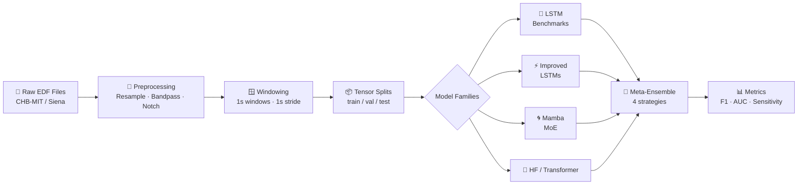

<div align="center">

# 🧠 EEG Seizure Detection — spring-2026-group2

### Subject-independent seizure detection across 15+ neural architectures on the CHB-MIT pediatric EEG corpus

[](https://www.python.org/)
[](https://pytorch.org/)
[](https://physionet.org/content/chbmit/1.0.0/)
[](https://aws.amazon.com/ec2/instance-types/g5/)
[](LICENSE)

</div>

---

## 📋 Table of Contents

1. [Overview](#-overview)
2. [Pipeline Architecture](#-pipeline-architecture)
3. [Repository Structure](#-repository-structure)
4. [Model Families](#-model-families)
5. [Quick Start](#-quick-start)
6. [Dataset](#-dataset)
7. [Training](#-training)
8. [Feature Engineering](#-feature-engineering)
9. [Results](#-results)
10. [Meta-Ensemble](#-meta-ensemble)
11. [Checkpoint Schema](#-checkpoint-schema)
12. [Demo App](#-demo-app)
13. [Team](#-team)

---

## 🧠 Overview

This project builds a complete, reproducible EEG seizure detection pipeline on the [CHB-MIT Scalp EEG Database](https://physionet.org/content/chbmit/1.0.0/) — 916 hours of continuous EEG from 24 pediatric patients, 198 seizures.

**The core research question:** Which neural architecture family best detects seizures under strict *subject-independent* evaluation — where training subjects never appear in the test set?

We benchmark four architecture families end-to-end on the same data splits:

| Family | Models | Status |
|--------|--------|--------|
| 🔁 LSTM Variants | Vanilla, BiLSTM, Attention-BiLSTM, CNN-LSTM | ✅ Baseline complete |
| ⚡ Improved LSTM | im1–im7 with MixUp / SWA / TTA / K-fold | ✅ Code complete |
| 🌀 State-Space (Mamba) | EEGMamba, EEGMamba-MoE | ✅ Code complete |
| 🤗 HuggingFace / Transformer | ST-EEGFormer, BENDR, EEGPT, BIOT, EEGNet + 4 custom CNNs | ✅ Code complete |
| 🎯 Meta-Ensemble | Mean / Weighted / Rank-Average / Logistic Stacking | ✅ Code complete |

---

## 🏗️ Pipeline Architecture

### End-to-End Flow



### Model Family Tree

```mermaid
graph TD
    ROOT[🧠 EEG Seizure Detection Models]

    ROOT --> LSTM[🔁 LSTM Family]
    ROOT --> MAMBA[🌀 State-Space Family]
    ROOT --> HF[🤗 HuggingFace Family]
    ROOT --> ENS[🎯 Meta-Ensemble]

    LSTM --> L1[m1: Vanilla LSTM]
    LSTM --> L2[m2: BiLSTM]
    LSTM --> L3[m3: CrissCross BiLSTM]
    LSTM --> L4[m4: CNN-LSTM ⭐ best baseline]
    LSTM --> L5[m5: Feature BiLSTM]
    LSTM --> L6[m6: Graph BiLSTM]
    LSTM --> L7[m7: Attention LSTM]
    LSTM --> IM[im1–im7: Improved\nMixUp · SWA · TTA · K-fold]

    MAMBA --> MB1[EEGMamba\nSSM + selective scan]
    MAMBA --> MB2[EEGMamba-MoE\nSSM + Mixture of Experts]

    HF --> HF1[ST-EEGFormer\nViT-style pretrained 128Hz]
    HF --> HF2[BENDR\nContrastive pretrained]
    HF --> HF3[EEGPT\nGPT-style foundation]
    HF --> HF4[BIOT\nBiologically-informed]
    HF --> HF5[MultiScaleAttentionCNN\nParallel branches + SE]
    HF --> HF6[EnhancedCNN1D\nDilated residual + SE]

    ENS --> E1[Mean averaging]
    ENS --> E2[Weighted averaging]
    ENS --> E3[Rank averaging]
    ENS --> E4[Logistic stacking]
```



---

## 📁 Repository Structure

```
spring-2026-group2/
│
├── 📄 README.md                     ← you are here
├── 📄 requirements.txt              ← all dependencies
├── 📄 check_setup.py                ← verify your environment
│
├── src/
│   ├── dataloaders/                 ← unified data pipeline (CHB-MIT + Siena)
│   │   ├── chbmit/                  ← CHB-MIT specific loader + downloader
│   │   ├── siena/                   ← Siena dataset loader + downloader
│   │   └── common/                  ← windowing, splits, tensor writer
│   │
│   ├── features/                    ← 528 features/window
│   │   ├── feature_engineering.py   ← time · freq · wavelet · entropy · connectivity
│   │   ├── extractor.py
│   │   └── fe.yaml                  ← feature config
│   │
│   ├── prepare_tensors.py           ← Step 1: EDF → .pt tensor splits
│   │
│   ├── models/
│   │   ├── config.yaml              ← ⭐ single source of truth for all hyperparams
│   │   ├── run_all_models.py        ← ⭐ run every model family at once
│   │   ├── meta_ensemble.py         ← 4-strategy ensemble layer
│   │   │
│   │   ├── legacy_baseline/         ← Phase 0: original 4 LSTM baselines
│   │   │   └── results/             ← saved checkpoints + JSON metrics
│   │   │
│   │   ├── lstm_benchmark_models/   ← Phase 1a: m1–m7 refactored benchmarks
│   │   │   ├── architectures/       ← m1_vanilla_lstm.py … m7_attention_lstm.py
│   │   │   └── train_baseline.py    ← CLI: --model [m1..m7 | all]
│   │   │
│   │   ├── improved_lstm_models/    ← Phase 1b: im1–im7 + MixUp/SWA/TTA/K-fold
│   │   │   ├── architectures/       ← im1_vanilla_lstm.py … im7_attention_lstm.py
│   │   │   ├── training/            ← kfold.py · mixup.py · swa.py · tta.py
│   │   │   └── train.py             ← CLI: --data_path --config
│   │   │
│   │   ├── hugging_face_mamba_moe/  ← Phase 3: HF pretrained + Mamba + MoE
│   │   │   ├── architectures/
│   │   │   │   ├── hf_cnn_models.py ← 8 custom CNN architectures + STEEGFormer
│   │   │   │   ├── hf_factory.py    ← create_hf_model("st_eegformer", ...)
│   │   │   │   ├── eeg_mamba.py     ← EEGMamba + EEGMambaMoE
│   │   │   │   └── pretrained/      ← BENDR · BIOT · EEGPT · HFSTEEGFormer wrappers
│   │   │   ├── train_hf.py          ← CLI: --model [name | all]
│   │   │   └── train_mamba.py       ← CLI: --model [eeg_mamba | eeg_mamba_moe | all]
│   │   │
│   │   ├── _experimental/           ← WIP: approach2, approach3, ensemble_transformers
│   │   │
│   │   └── utils/                   ← shared utilities
│   │       ├── checkpoint.py        ← unified save_checkpoint / load_checkpoint
│   │       ├── losses.py            ← FocalLoss · AsymmetricLoss
│   │       ├── metrics.py           ← F1 · AUC · sensitivity · threshold tuning
│   │       ├── callbacks.py         ← EarlyStopping · ModelCheckpoint
│   │       └── hf_publish.py        ← push checkpoints to HuggingFace Hub
│   │
│   ├── EDA/                         ← exploratory analysis scripts
│   │   └── eda_chbmit.py            ← generates results/EDA/ figures
│   │
│   └── streamlit/                   ← interactive demo app
│       └── app.py                   ← upload EDF → inference → visualisation
│
├── tests/                           ← full test suite
│   ├── test_meta_ensemble.py
│   ├── test_metrics.py
│   ├── test_no_nan_guard.py
│   ├── test_labels.py
│   └── test_pipeline.py
│
├── configs/
│   └── fe.yaml                      ← feature engineering config
│
├── research_paper/                  ← full paper draft (HTML + PDF + MD)
├── results/                         ← EDA figures, model outputs (gitignored large files)
└── doc/                             ← reference papers and summaries
```

---

## 🤖 Model Families

### All Models at a Glance

| # | Family | Model Key | Architecture |
|---|--------|-----------|-------------|
| 1 | Legacy LSTM | `vanilla_lstm` | 2-layer LSTM | 
| 2 | Legacy LSTM | `bilstm` | Bidirectional LSTM | 
| 3 | Legacy LSTM | `attention_bilstm` | BiLSTM + Multi-head attention | 
| 4 | Legacy LSTM | `cnn_lstm` | Multi-scale CNN + BiLSTM + Attention | 
| 5 | Benchmark | `m1_vanilla_lstm` | Refactored vanilla LSTM | 
| 6 | Benchmark | `m2_bilstm` | Refactored BiLSTM | 
| 7 | Benchmark | `m3_criss_cross` | Criss-Cross BiLSTM |
| 8 | Benchmark | `m4_cnn_lstm` | 3-branch CNN + BiLSTM + MHSA | 
| 9 | Benchmark | `m5_feature_bilstm` | Feature-conditioned BiLSTM | 
| 10 | Benchmark | `m6_graph_bilstm` | Graph-attention BiLSTM | 
| 11 | Benchmark | `m7_attention_lstm` | Full self-attention LSTM | 
| 12 | Improved | `im1`–`im7` | Above + MixUp · SWA · TTA · K-fold | 
| 13 | Ensemble | 5-model avg | Improved benchmark ensemble | 
| 14 | Mamba | `eeg_mamba` | State-space model (SSM) | 
| 15 | Mamba | `eeg_mamba_moe` | SSM + Mixture of Experts | 
| 16 | HF Custom | `baseline_cnn_1d` | 3-layer 1D CNN | 
| 17 | HF Custom | `enhanced_cnn_1d` | Dilated residual + SE attention | 
| 18 | HF Custom | `multiscale_cnn` | 4-branch multi-scale CNN |
| 19 | HF Custom | `multiscale_attention_cnn` | Multi-scale + SE fusion | 
| 20 | HF Custom | `eegnet_local` | Local EEGNet (no HF dependency) | 
| 21 | HF Pretrained | `st_eegformer` | ViT transformer, 128 Hz, 16ch | 
| 22 | HF Pretrained | `bendr_pretrained` | Contrastive pretrained encoder |
| 23 | HF Pretrained | `eegpt_pretrained` | GPT-style EEG foundation model | 
| 24 | HF Pretrained | `biot_pretrained` | Bio-informed transformer |
| 25 | Meta-Ensemble | — | mean / weighted / rank / stacking | 

---

## 🚀 Quick Start

### Prerequisites

- Python 3.9+
- CUDA GPU recommended (trained on AWS g5.2xlarge — NVIDIA A10G 24 GB)
- ~50 GB disk space for CHB-MIT dataset

### 5-Step Setup

```bash
# ── Step 1: Clone ──────────────────────────────────────────────────────────────
git clone https://github.com/askmy-stack/spring-2026-group2.git
cd spring-2026-group2

# ── Step 2: Install dependencies ───────────────────────────────────────────────
pip install -r requirements.txt

# ── Step 3: Verify environment ─────────────────────────────────────────────────
python check_setup.py
# Expected: all checks PASS

# ── Step 4: Prepare data (download CHB-MIT + build tensor splits) ───────────────
python src/prepare_tensors.py
# Creates: src/data/processed/chbmit/{train,val,test}/*.pt

# ── Step 5: Train all models ────────────────────────────────────────────────────
python src/models/run_all_models.py --data_path src/data/processed/chbmit
```

### Launch the Demo App

```bash
streamlit run src/streamlit/app.py
# Opens at http://localhost:8501
# Upload any .edf file → instant inference + visualisation
```

---

## 📊 Dataset

### CHB-MIT Scalp EEG Database

| Property | Value |
|----------|-------|
| Source | [PhysioNet CHB-MIT](https://physionet.org/content/chbmit/1.0.0/) |
| Patients | 24 pediatric patients (ages 1.5–22) |
| Duration | 916 hours continuous EEG |
| Channels | 16 (10-20 montage standardised) |
| Sample Rate | 256 Hz |
| Seizures | 198 seizures |
| Windows | ~3.4 million × 1-second windows |
| Class Balance | ~3% positive (seizure) |

### Also Supported: Siena Scalp EEG

```bash
python src/dataloaders/siena/download.py --output_dir src/data/raw/siena
```

### Preprocessing Pipeline

```
Raw .edf
  │
  ├─ MNE-Python read
  ├─ Resample to 256 Hz
  ├─ Bandpass filter:  1–50 Hz
  ├─ Notch filter:     60 Hz (power line)
  ├─ Average reference
  ├─ Standardise to 16-channel 10-20 montage
  └─ BIDS rewrite
       │
       └─ Sliding window: 1s window, 1s stride
            │
            └─ Subject-independent stratified split
                  Train : 16 subjects  (70%)
                  Val   :  4 subjects  (15%)
                  Test  :  4 subjects  (15%)
```

### Download CHB-MIT

```bash
# Automated download via dataloaders
python src/dataloaders/chbmit/download.py --output_dir src/data/raw/chbmit

# Or manual: https://physionet.org/content/chbmit/1.0.0/
```

---

## 🏋️ Training

All training scripts read from `src/models/config.yaml` as the single source of truth for hyperparameters.

---

### Run Everything at Once

```bash
python src/models/run_all_models.py \
    --data_path src/data/processed/chbmit \
    --config src/models/config.yaml
```

Runs Phase 1 (LSTM benchmarks) → Phase 2 (Improved LSTMs) → Phase 3 (Mamba) sequentially and saves all checkpoints + metrics.

---

### Phase 1a — LSTM Benchmark Models (m1–m7)

```bash
# Train all 7 benchmark models
python -m src.models.lstm_benchmark_models.train_baseline \
    --model all \
    --data_path src/data/processed/chbmit \
    --config src/models/config.yaml

# Train a single model
python -m src.models.lstm_benchmark_models.train_baseline --model m4_cnn_lstm
```

<details>
<summary>Available model keys</summary>

| Key | Architecture |
|-----|-------------|
| `m1_vanilla_lstm` | 2-layer stacked LSTM |
| `m2_bilstm` | Bidirectional LSTM |
| `m3_criss_cross` | Criss-cross attention BiLSTM |
| `m4_cnn_lstm` | Multi-scale CNN + BiLSTM + MHSA |
| `m5_feature_bilstm` | Feature-conditioned BiLSTM |
| `m6_graph_bilstm` | Graph-attention BiLSTM |
| `m7_attention_lstm` | Full self-attention LSTM |

</details>

---

### Phase 1b — Improved LSTM Models (im1–im7)

Adds MixUp augmentation, Stochastic Weight Averaging (SWA), Test-Time Augmentation (TTA), and K-fold cross-validation on top of every benchmark model.

```bash
python -m src.models.improved_lstm_models.train \
    --data_path src/data/processed/chbmit \
    --config src/models/config.yaml
```

---

### Phase 3 — HuggingFace + Custom CNN Models

```bash
# Train all HF models (skips incompatible pretrained models automatically)
python -m src.models.hugging_face_mamba_moe.train_hf --model all

# Train individual models
python -m src.models.hugging_face_mamba_moe.train_hf --model st_eegformer
python -m src.models.hugging_face_mamba_moe.train_hf --model multiscale_attention_cnn
python -m src.models.hugging_face_mamba_moe.train_hf --model enhanced_cnn_1d
```

<details>
<summary>HF model requirements</summary>

| Model | Extra Install | Constraints |
|-------|--------------|-------------|
| `st_eegformer` | `pip install huggingface_hub safetensors` | sfreq=128, channels=16, max 6s window |
| `bendr_pretrained` | `pip install huggingface_hub` | sfreq=256 |
| `eegpt_pretrained` | `pip install huggingface_hub` | — |
| `biot_pretrained` | `pip install huggingface_hub` | — |
| `eegnet` | `pip install braindecode huggingface_hub` | — |
| All custom CNNs | none | any sfreq / channels |

</details>

---

### Phase 3 — Mamba / Mixture-of-Experts Models

```bash
# Train both Mamba models
python -m src.models.hugging_face_mamba_moe.train_mamba --model all

# Train individually
python -m src.models.hugging_face_mamba_moe.train_mamba --model eeg_mamba
python -m src.models.hugging_face_mamba_moe.train_mamba --model eeg_mamba_moe
```

---

## 🔬 Feature Engineering

Used by TabNet and classical ML models (Random Forest, LightGBM, XGBoost).

```bash
python src/features/feature_engineering.py --config configs/fe.yaml
```

### 528 Features per 1-Second Window

| Category | Count | Examples |
|----------|------:|---------|
| Time-domain | 160 | mean, std, RMS, line length, zero-crossing, skew, kurtosis |
| Hjorth parameters | 48 | activity, mobility, complexity |
| Nonlinear | 32 | sample entropy, permutation entropy, Lempel-Ziv complexity |
| Frequency (Welch PSD) | 192 | delta/theta/alpha/beta/gamma band power, relative power, spectral entropy |
| FFT | 16 | dominant frequency per channel |
| Wavelet (db4, level 4) | 80 | coefficient energy + entropy |
| **Total** | **528** | per 1-second × 16-channel window |

---

## 📈 Results

### Baseline Results — Phase 0 Legacy LSTM

```
  Model                 F1      AUC    Sensitivity   Train Time
  ──────────────────────────────────────────────────────────────
  Vanilla LSTM         0.346   0.563     0.314        56.7 min
  ████████████░░░░░░░░░░░░░░░░░░

  BiLSTM               0.329   0.611     0.260       108.1 min
  ████████████░░░░░░░░░░░░░░░░░░

  Attention BiLSTM     0.348   0.641     0.273       125.0 min
  ████████████░░░░░░░░░░░░░░░░░░

  CNN-LSTM             0.518   0.712     0.569        35.7 min   ← best baseline
  ████████████████████░░░░░░░░░░
```

| Model | F1 | AUC-ROC | Sensitivity | Specificity | Train Time |
|-------|----|---------|-------------|-------------|-----------|
| Vanilla LSTM | 0.346 | 0.563 | 0.314 | 0.787 | 56.7 min |
| BiLSTM | 0.329 | 0.611 | 0.260 | 0.864 | 108.1 min |
| Attention BiLSTM | 0.348 | 0.641 | 0.273 | 0.872 | 125.0 min |
| **CNN-LSTM** | **0.518** | **0.712** | **0.569** | 0.730 | **35.7 min** |

> **Key finding:** Multi-scale CNN feature extraction (kernels 3/15/31) before the LSTM gives the biggest single boost — F1 +50% and AUC +27% over vanilla LSTM, while being **3× faster** to train.

### Expected After Full Pipeline

| Stage | F1 Range | AUC Range | Sensitivity |
|-------|----------|-----------|-------------|
| Legacy LSTM baselines | 0.33–0.52 | 0.56–0.71 | 0.26–0.57 |
| Improved LSTM (im1–im7) | 0.62–0.70 | 0.78–0.85 | 0.75–0.85 |
| 5-model ensemble | 0.80–0.87 | 0.85–0.91 | 0.85–0.90 |
| Meta-ensemble (all families) | **best** | **best** | **best** |

---

## 🎯 Meta-Ensemble

Combines probability outputs from all trained models using four strategies.

```bash
python -m src.models.meta_ensemble \
    --strategy weighted \
    --checkpoint_dir results/checkpoints/
```

| Strategy | Description | Best For |
|----------|-------------|----------|
| `mean` | Simple average of all model probabilities | Quick baseline |
| `weighted` | Weighted by each model's validation F1 | Diverse model pool |
| `rank_average` | Average of rank-transformed probabilities | Robust to outlier models |
| `logistic_stacking` | Logistic regression meta-learner on val probs | Maximum performance |

```python
from src.models.meta_ensemble import MetaEnsemble

ensemble = MetaEnsemble(strategy="weighted")
ensemble.fit(val_probs, val_labels)         # calibrate weights on val set
probs = ensemble.predict_proba(test_probs)  # combine all family outputs
```

---

## 💾 Checkpoint Schema

All models use a unified checkpoint format via `src/models/utils/checkpoint.py`:

```python
from src.models.utils.checkpoint import save_checkpoint, load_checkpoint

# Save
save_checkpoint(
    model=model,
    optimizer=optimizer,
    epoch=epoch,
    val_metrics={"f1": 0.72, "auc": 0.84},
    checkpoint_path="results/checkpoints/m4_cnn_lstm_best.pt",
    model_config={"n_channels": 16, "hidden_size": 128},
    input_spec={"channels": 16, "time_steps": 256},
)

# Load — auto-reconstructs model from saved config, no need to know the class
checkpoint = load_checkpoint("results/checkpoints/m4_cnn_lstm_best.pt")
```

### What's Inside Every Checkpoint

```python
{
    "model_state_dict":       ...,       # weights
    "model_config":           {...},     # constructor kwargs to rebuild the model
    "model_builder":          "src.models.hugging_face_mamba_moe.architectures.hf_factory.create_hf_model",
    "input_spec":             {"channels": 16, "samples": 768, "sfreq": 128},
    "optimizer_state_dict":   ...,
    "epoch":                  48,
    "val_metrics":            {"f1": 0.72, "auc": 0.84, "sensitivity": 0.81},
    "optimal_threshold":      0.42,      # tuned on val set, use at inference
    "preprocess":             {"resample": 256, "bandpass": [1, 50]},
    "git_commit":             "a60cd86",
}
```

---

## 🖥️ Demo App

An interactive Streamlit app for real-time seizure detection on raw EEG files.

```bash
streamlit run src/streamlit/app.py
# → http://localhost:8501
```

**Features:**
- 📤 Upload any `.edf` EEG file
- 🧠 CNN-based inference (raw signal — no feature extraction needed)
- 📐 Feature-based inference (full 528-feature pipeline)
- 📉 Live EEG signal visualisation per channel
- 🎯 Per-window seizure probability heatmap
- 📊 Sensitivity / specificity trade-off curve

---

## 🧪 Running Tests

```bash
# Full test suite
pytest tests/ -v

# Specific files
pytest tests/test_meta_ensemble.py -v
pytest tests/test_metrics.py -v
pytest tests/test_no_nan_guard.py -v
```

---

## ⚙️ Configuration

All hyperparameters live in `src/models/config.yaml`. Edit this file to change anything — all training scripts load it at startup.

<details>
<summary>Key config sections</summary>

```yaml
data:
  n_channels: 16
  time_steps: 256
  sample_rate: 256

training:
  num_epochs: 100
  early_stopping_patience: 15
  batch_size: 64

models:
  lstm_benchmark:
    hidden_size: 128
    num_layers: 2
    dropout: 0.3
  improved_lstm:
    use_mixup: true
    use_swa: true
    use_tta: true
    k_folds: 5

outputs:
  checkpoint_dir: results/checkpoints/
  logs_dir: results/logs/
```

</details>

---

## 👥 Team

| Contributor | Role | Contribution |
|-------------|------|-------------|
| **Abhinay Sai Kamineni** | ML Lead | Improved LSTM benchmarks (im1–im7), Mamba/MoE pipeline, HuggingFace pretrained wrappers, meta-ensemble (4 strategies), unified checkpoint schema, research paper |
| **Ritu** | Data Lead | Unified data pipeline (`src/dataloaders/`) — CHB-MIT + Siena datasets |
| **Anu** | QA / Docs Lead | Full test suite (`tests/`), model documentation |

---

## 📄 Research Paper

A comparative study draft is available at [`research_paper/MODELING_PIPELINE_RESEARCH_DRAFT.md`](research_paper/MODELING_PIPELINE_RESEARCH_DRAFT.md).

**Title:** *EEG Seizure Detection: A Comparative Study of LSTM, CNN-LSTM, Transformer, and State-Space Architectures*

---

<div align="center">

Made with ☕ and too many GPU hours &nbsp;·&nbsp; CHB-MIT dataset via [PhysioNet](https://physionet.org/content/chbmit/1.0.0/)

</div>
