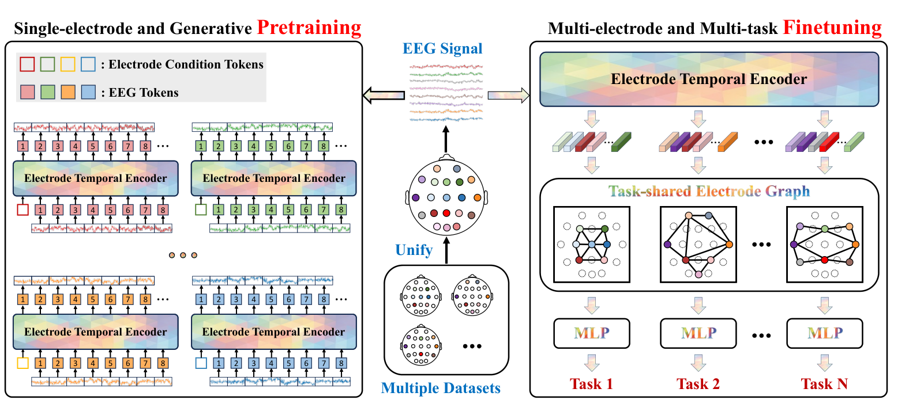

# BrainGPT: Unleashing the Potential of EEG Generalist Foundation Model by Autoregressive Pre-training



## Paper Information
- **Authors**: Tongtian Yue, Xuange Gao, Shuning Xue, Yepeng Tang, Longteng Guo, Jie Jiang, Jing Liu
- **Affiliation**: Institute of Automation, Chinese Academy of Sciences
- **arXiv ID**: 2410.19779v2
- **Publication Date**: August 29, 2025

## Problem Being Solved

The exploration of versatile EEG models is severely constrained by three major challenges:

1. **Diverse Data Formats**: EEG data exhibit significant heterogeneity with variations in data collection devices, experimental tasks, and different numbers/combinations of electrodes across datasets. This inconsistency hinders integration into a unified model.

2. **Outdated Pre-training Paradigms**: Current EEG foundation models rely on masked autoencoder (MAE) architectures that reconstruct masked portions using bidirectional attention. These approaches exhibit limitations in modeling the temporal dependencies critical to EEG data, often neglecting global temporal structure and long-range dependencies.

3. **Limited Transfer Learning**: Existing models are typically fine-tuned for specific datasets, resulting in specialists confined to narrow domains. This approach is inefficient (costly to fine-tune for each task) and ineffective (fails to explore multi-task compatibility and synergistic interactions).

## Key Innovation and Approach

BrainGPT introduces **the first generalist EEG foundation model** with three major innovations:

### 1. Electrode-wise Modeling Strategy
- Treats data from each electrode as an independent sample
- Enables integration of diverse EEG datasets from nearly all commonly used electrodes
- Amasses **37.5M pre-training samples** with approximately **1B tokens**
- Supports up to **138 electrodes** and any combination thereof as input
- Uses learnable electrode vocabulary with special tokens assigned to each electrode as prefix condition

### 2. Autoregressive Pre-training Paradigm
- **First autoregressive EEG foundation model** moving away from traditional MAE approaches
- Uses next-token-prediction task that better captures temporal dependencies of EEG data
- Implements causal attention mechanism to ensure temporal ordering
- Scales up to **billion-level parameters** (BrainGPT-Giant: 1.09B parameters) - the largest scale in EEG research to date
- Validates scaling laws for both data and model size

### 3. Multi-task Transfer Learning with Task-shared Electrode Graph (TEG)
- Learnable graph network with electrodes as nodes, shared across multiple tasks
- Node activation patterns adaptively determined by input task
- Progressive spatiotemporal decoupling: temporal features from pre-trained Electrode Temporal Encoder (ETE), spatial features from TEG
- Enables **simultaneous multi-task compatibility** - first generalist EEG model
- Demonstrates confirmed multi-task synergism with mutual enhancement across tasks

## Model Architecture Details

### Architecture Components

**Electrode Temporal Encoder (ETE)**:
- Autoregressive transformer architecture with causal attention
- L identical layers, each containing:
  - Multi-head causal attention mechanism
  - Position-wise feed-forward network with Swish activation
  - Residual connections and normalization
- Pre-trained using next-token prediction on individual electrode signals

**Task-shared Electrode Graph (TEG)**:
- Fully connected graph with E nodes (total electrodes)
- Graph attention mechanism for spatial information integration
- Dynamic subgraph activation based on input electrodes
- Shared across all downstream tasks for multi-task learning

### Model Variants

| Configuration | Base | Large | Huge | Giant |
|--------------|------|-------|------|-------|
| ETE Layers | 3 | 9 | 12 | 20 |
| TEG Layers | 3 | 3 | 4 | 4 |
| Hidden Size | 128 | 256 | 896 | 1,792 |
| Attention Heads | 4 | 8 | 14 | 28 |
| Total Parameters | 1.46M | 11.29M | 183.8M | 1.09B |

### Training Details

**Stage I - Autoregressive Pre-training**:
- Dataset: 37.5M samples (~1B tokens)
- Epochs: 3
- Batch size: 4096
- Learning rate: 1e-4
- Optimization: AdamW with cosine decay schedule
- Loss: MSE reconstruction loss for next-token prediction

**Stage II - Multi-task Fine-tuning**:
- Dataset: 181K samples across 12 benchmarks
- Epochs: 10
- Batch size: 512
- Learning rate: 1e-4
- ETE parameters frozen, only TEG network trained
- Optimization: AdamW with cosine decay schedule

## Main Results and Contributions

### Performance Achievements

BrainGPT-Giant demonstrates superior performance across **5 distinct downstream tasks** and **12 benchmarks**, consistently outperforming specialist models:

- **Emotion Recognition (ER)**: +5.07% average improvement (DEAP, FACED, SEED-IV, SEED-V)
- **Motor Imagery (MI)**: +6.05% average improvement (MIBCI, BCIC4-1)
- **Mental Workload (MW)**: +8.50% average improvement (EEGMat, STEW)
- **Sleep Stage (SS)**: +11.20% average improvement (EDF, HMC)
- **Cross Modality (CM)**: +5.10% average improvement (IMG, SPE)

### Key Findings

1. **Scaling Laws Validated**: First demonstration of scaling laws in EEG domain - both model size and data volume show positive correlation with downstream performance

2. **Autoregressive Superiority**: Autoregressive pre-training outperforms masked autoencoder (MAE) by over 2% average accuracy across all tasks

3. **Multi-task Synergy**: Joint multi-task training outperforms separate task-specific training, with especially pronounced improvements for smaller datasets (e.g., +3.9% for Mental Workload vs +0.9% for Sleep Stage)

4. **Cross-Domain Generalization**: Strong transferability demonstrated even on unseen datasets (DREAMER) without additional training

5. **Versatility**: Single generalist model handles diverse subjects, acquisition devices (supporting various electrode configurations), and multiple task types simultaneously

## Datasets Used

### Pre-training Datasets
- Multiple EEG datasets with diverse electrode configurations
- Total: 37.5M samples, ~1B tokens
- Coverage: Up to 138 unique electrodes from various EEG acquisition systems

### Evaluation Datasets (12 Benchmarks across 5 Tasks)

**Emotion Recognition**:
- DEAP: 32 subjects, 32 electrodes, 19.2k samples, 4 classes
- FACED: 123 subjects, 30 electrodes, 27.6k samples, 9 classes
- SEED-IV: 15 subjects, 62 electrodes, 37.6k samples, 4 classes
- SEED-V: 16 subjects, 62 electrodes, 29.2k samples, 5 classes

**Motor Imagery**:
- MIBCI: 52 subjects, 64 electrodes, 10.5k samples, 2 classes
- BCIC4-1: 7 subjects, 38 electrodes, 1.4k samples, 2 classes

**Mental Workload**:
- EEGMat: 34 subjects, 19 electrodes, 1.0k samples, 2 classes
- STEW: 45 subjects, 14 electrodes, 3.3k samples, 3 classes

**Sleep Stage Classification**:
- EDF: 78 subjects, 2 electrodes, 19.5k samples, 5 classes
- HMC: 151 subjects, 4 electrodes, 22.6k samples, 5 classes

**Cross Modality**:
- IMG: 29 subjects, 122 electrodes, 7.6k samples, 5 classes
- SPE: 7 subjects, 64 electrodes, 1.3k samples, 2 classes

## Contributions to the Field

1. **First Generalist EEG Foundation Model**: Demonstrates that a single model can effectively handle multiple tasks, subjects, and devices simultaneously

2. **Novel Pre-training Paradigm**: Introduces autoregressive pre-training to EEG domain, better capturing temporal dependencies than MAE-based approaches

3. **Scalability Framework**: Provides evidence for scaling laws in EEG, paving the way for even larger models

4. **Electrode-wise Modeling**: Flexible and scalable approach to handle heterogeneous EEG data formats

5. **Multi-task Learning Framework**: Confirms multi-task compatibility and synergism through shared electrode graph network

6. **State-of-the-art Performance**: Outperforms both pre-trained and from-scratch specialist models across all evaluated tasks

## Code and Model Availability

The authors indicate that both training code and model checkpoints will be publicly available.

## Citation

```bibtex
@article{yue2024braingpt,
  title={BrainGPT: Unleashing the Potential of EEG Generalist Foundation Model by Autoregressive Pre-training},
  author={Yue, Tongtian and Gao, Xuange and Xue, Shuning and Tang, Yepeng and Guo, Longteng and Jiang, Jie and Liu, Jing},
  journal={arXiv preprint arXiv:2410.19779},
  year={2024}
}
```