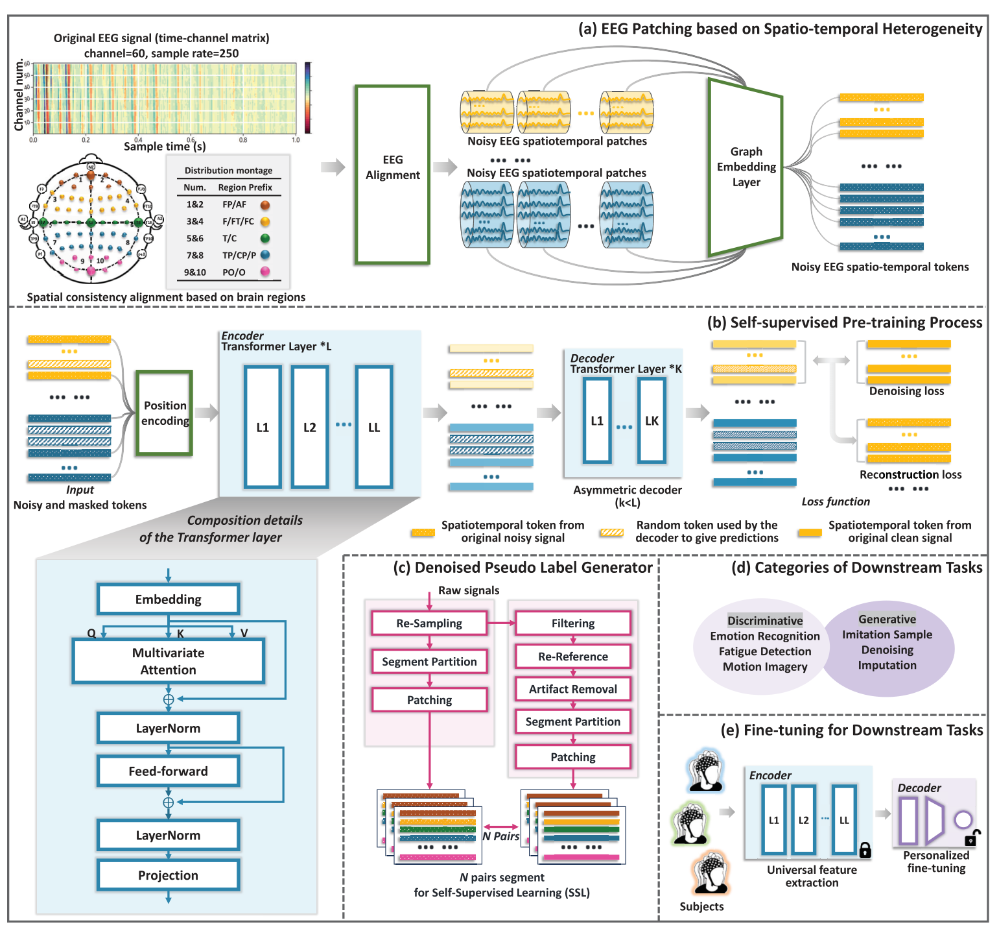

# DMAE-EEG: A Pretraining Framework for EEG Spatiotemporal Representation Learning

**Authors:** Yifan Zhang, Yang Yu, Hao Li, Anqi Wu, Xin Chen, Jinfang Liu, Ling-Li Zeng, and Dewen Hu

**Published:** IEEE Transactions on Neural Networks and Learning Systems, Vol. 36, No. 10, October 2025

---

## Model Architecture



*Figure 1: Overview of the DMAE-EEG pretraining framework showing (a) BRTH patch division, (b) asymmetric encoder-decoder architecture, (c) denoised pseudo-label generator, (d) downstream tasks, and (e) fine-tuning process.*

---

## Problem Being Solved

Electroencephalography (EEG) analysis faces three major challenges:
- **Limited labeled data**: EEG annotation is difficult and costly due to noise, artifacts, and variability across conditions
- **Nonuniform data formats**: Inconsistent channel configurations and sampling rates across different recording devices
- **Low signal-to-noise ratio**: Noninvasive EEG signals are heavily affected by noise and artifacts, impacting accuracy and robustness

Traditional supervised deep learning methods require substantial labeled data, which is scarce in EEG research. Existing self-supervised learning approaches often fail to effectively model spatial dynamics and struggle with noisy, artifact-ridden EEG signals.

---

## Key Innovation/Approach

DMAE-EEG introduces three main innovations:

1. **Brain Region Topological Heterogeneity (BRTH) Division**: A neuroscientifically-inspired patch division method that segments nonuniform EEG signals into fixed patches based on cortical brain regions and temporal segments. This preserves spatial relationships and enables cross-device alignment.

2. **Denoised Pseudo-Label Generator (DPLG)**: A novel self-supervised pretext task that combines denoising and masked reconstruction. The DPLG generates clean pseudo-labels from noisy unlabeled EEG, enabling the model to learn robust representations while suppressing noise and artifacts.

3. **Asymmetric Transformer Autoencoder**: Uses multi-head self-attention mechanisms to capture both local and global spatiotemporal dependencies. The encoder processes visible (unmasked) patches, while the lightweight decoder reconstructs missing and denoised signals.

The framework combines these components in a composite loss function:
- **Reconstruction loss**: Matches predictions on masked tokens to ground truth
- **Denoising loss**: Aligns overall decoder output to clean pseudo-labels

---

## Model Architecture Details

### Input Processing (BRTH Patcher)
- Divides electrodes into M=10 super-nodes based on cortical regions (Frontal, Temporal, Central, Parietal, Occipital for left/right hemispheres)
- Partitions time dimension into N temporal segments
- Creates M×N spatiotemporal patches that preserve neuroanatomical structure
- Generates D-dimensional embeddings for each patch using graph pooling

### Encoder
- Transformer-based architecture with L layers
- Each layer contains:
  - Multi-head self-attention mechanism
  - Feed-forward neural network
  - Residual connections and layer normalization
- Processes only visible (unmasked) patches
- High masking ratio of 75% during pretraining

### Decoder
- Asymmetric lightweight design (smaller than encoder)
- Appends random vectors to masked positions
- Stacked Transformer layers progressively refine representations
- Outputs complete denoised signal predictions

### Training Strategy
- Self-supervised pretraining on 14 public EEG datasets
- Intentional corruption: noise addition + masking
- No task-specific labels required
- Learns generalizable spatiotemporal representations

---

## Main Results/Contributions

### Signal Quality Enhancement (Generative Task)
- **25% missing data**: nMSE of 0.26, DC of 0.96 (27.78% improvement over STC baseline)
- **50% missing data**: nMSE of 0.34, DC of 0.93 (32.00% improvement over STC)
- **75% missing data**: nMSE of 0.38, DC of 0.91 (45.71% improvement over STC)
- Maintains high performance even under extreme corruption
- Works at both brain region-level and individual electrode-level

### Motion Intention Recognition (Discriminative Task)

**PhysionetMI Dataset:**
- Binary motor imagery (MI-H): 85.94% accuracy (3.16% improvement over best non-pretrained model)
- 4-class motor imagery (MI-HF): 72.40% accuracy (3.39% improvement)
- 4-class motor execution (MM-HF): 72.66% accuracy (4.17% improvement)

**MultiM11 Dataset:**
- 3-class hand grasping (MM-G): 89.78% accuracy (2.89% improvement)
- 6-class arm reaching (MM-R): 57.85% accuracy (1.85% improvement)
- 2-class wrist twisting (MM-T): 82.33% accuracy (5.66% improvement)

### Generalization Capabilities
- **Cross-session**: Maintains performance across different recording sessions with minimal calibration (50 samples)
- **Cross-subject**: Achieves 75%+ accuracy on new subjects with limited adaptation data
- **Cross-task**: Successfully transfers between motor execution and imagery tasks with zero-shot capabilities above random baseline

---

## Datasets Used

### Pretraining (14 Public Datasets)
- **PhysionetMI**: First 80 subjects, 64-channel recordings at 160 Hz
- **MultiM11**: First 15 subjects, 71-channel recordings at 2500 Hz
- Additional datasets covering motor-related, ERP, and SSVEP paradigms
- Diverse channel configurations and sampling rates

### Downstream Evaluation

**PhysionetMI** (subjects S81-S109):
- 64-channel EEG at 160 Hz sampling rate
- Tasks: 4-class motor execution and imagery (left fist, right fist, both feet, rest)
- Binary tasks: hand movements (MM-H, MI-H) and hand+feet (MM-HF, MI-HF)

**MultiM11** (subjects excluded from pretraining):
- 71-channel EEG at 2500 Hz sampling rate
- 11 intuitive upper extremity movements across 3 categories:
  - Hand grasping (3 classes): Spherical, Cylindrical, Lumbrical
  - Arm reaching (6 classes): different directions
  - Wrist twisting (2 classes): Supination, Pronation
- Both execution (MM) and imagery (MI) conditions
- Multiple recording sessions for longitudinal evaluation

---

## Clinical and Practical Impact

- **Enhanced BCI systems**: Improves motor intention decoding for assistive devices
- **Robust to noise**: Handles real-world EEG artifacts and missing electrodes
- **Scalable**: Reduces labeling burden through self-supervised pretraining
- **Cross-device compatibility**: BRTH alignment enables training across different EEG systems
- **Minimal calibration**: Fast adaptation to new sessions, subjects, and tasks

---

## Citation

```
Zhang, Y., Yu, Y., Li, H., Wu, A., Chen, X., Liu, J., Zeng, L.-L., & Hu, D. (2025).
DMAE-EEG: A Pretraining Framework for EEG Spatiotemporal Representation Learning.
IEEE Transactions on Neural Networks and Learning Systems, 36(10), 17664-17678.
DOI: 10.1109/TNNLS.2025.3581991
```

---

**Paper Link:** IEEE Transactions on Neural Networks and Learning Systems

**Keywords:** Electroencephalography (EEG), masked autoencoder, motion intention recognition, signal quality enhancement, self-supervised learning, brain-computer interface