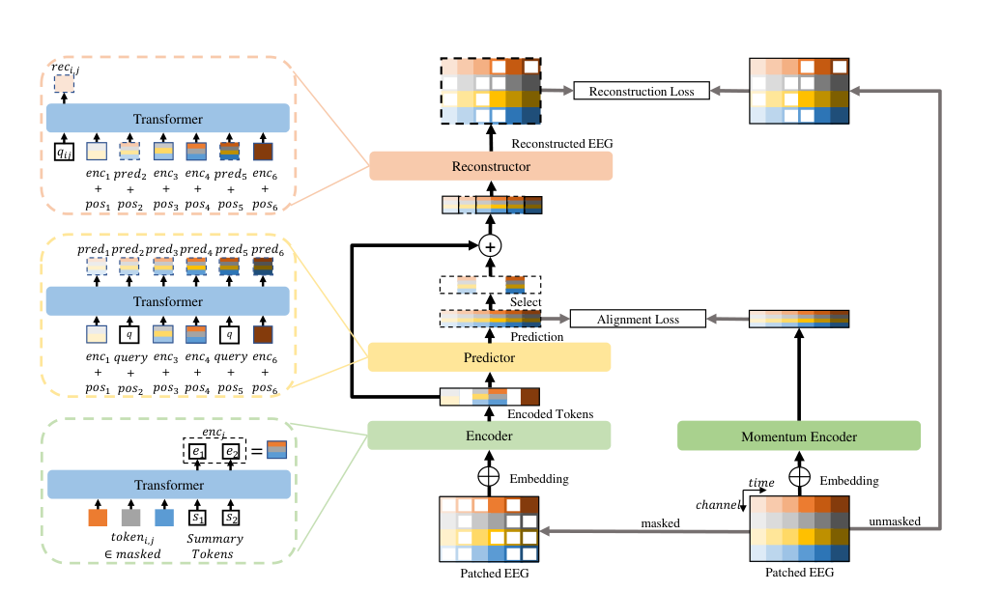

# EEGPT: Pretrained Transformer for Universal and Reliable Representation of EEG Signals

**Conference:** NeurIPS 2024
**Authors:** Guangyu Wang, Wenchao Liu, Yuhong He, Cong Xu, Lin Ma, Haifeng Li (Harbin Institute of Technology)
**Paper:** NeurIPS-2024-eegpt-pretrained-transformer-for-universal-and-reliable-representation-of-eeg-signals-Paper-Conference.pdf

## Main Architecture

The main model architecture is illustrated in **Figure 1** (page 4 of the paper), which shows the complete EEGPT structure with the following components:
- Patching and embedding of input EEG signals
- Masking (50% time and 80% channel patches)
- Encoder processing masked parts
- Predictor for temporal feature prediction
- Momentum Encoder for generating target representations
- Reconstructor for signal reconstruction
- Dual loss functions: Alignment Loss and Reconstruction Loss



*Figure 1: Complete EEGPT architecture diagram showing the dual self-supervised learning framework with predictor and reconstructor.*

---

## Problem Being Solved

EEG signal analysis faces several critical challenges:
- **Low Signal-to-Noise Ratio (SNR):** EEG signals are inherently noisy, making robust feature extraction difficult
- **High Inter-Subject Variability:** EEG patterns vary significantly across individuals
- **Channel Mismatch:** Different EEG acquisition devices use varying electrode configurations and sampling rates
- **Task-Dependent Variations:** EEG signals change significantly across different cognitive tasks
- **Limited Labeled Data:** Existing methods require extensive labeled data for each specific task

Traditional EEG analysis methods and existing self-supervised learning approaches struggle to extract universal, high-quality representations that work across multiple paradigms and subjects.

---

## Key Innovation/Approach

EEGPT introduces several novel innovations:

### 1. Dual Self-Supervised Learning Method
- **Spatio-Temporal Representation Alignment:** Aligns predicted features from masked patches with full signal features from a momentum encoder, enhancing representation quality
- **Mask-Based Reconstruction:** Reconstructs masked EEG patches based on spatial and temporal consistency
- Unlike traditional masked autoencoders (e.g., BERT-style), EEGPT explicitly learns high-SNR semantic representations rather than just reconstructing raw noisy signals

### 2. Hierarchical Encoder-Predictor Structure
- **Encoder:** Processes spatial information from masked patches at each time step
- **Predictor:** Captures temporal dependencies across time steps using encoded spatial features
- This separation reduces computational complexity while improving flexibility for BCI applications

### 3. Local Spatio-Temporal Embedding
- Patches EEG signals in both spatial (channel) and temporal dimensions
- Uses a learnable "Codex book" that maps channel names to embedding vectors
- Provides robust channel adaptation across different EEG acquisition devices
- Enables the model to handle varying electrode configurations

### 4. Momentum Encoder
- Maintains exponential moving average of encoder parameters (τ = 0.01)
- Provides stable, high-quality target representations for alignment
- Prevents representation collapse during training

---

## Model Architecture Details

### Input Processing
- **Input:** EEG signal x ∈ ℝ^(M×T) where M=58 channels, T=1024 time points (4 seconds at 256 Hz)
- **Patch Size:** 64 time points (250ms windows)
- **Masking Strategy:** 50% of time patches and 80% of channel patches are masked

### Network Components

**Encoder:**
- Based on Vision Transformer (ViT) architecture
- Processes all masked tokens at each time step
- Outputs spatial features (enc_j) and summary tokens {s_i}
- Uses rotary position embeddings (RoPE) for temporal information

**Predictor:**
- Transformer-based architecture
- Takes encoder features + positional embeddings
- Uses learnable query tokens to predict features for masked time steps
- Outputs predicted features (pred_j) for all time segments

**Momentum Encoder:**
- Identical structure to encoder
- Processes both masked and unmasked tokens
- Parameters updated via exponential moving average (τ = 0.01)

**Reconstructor:**
- Combines encoder features (masked parts) and predictor features (unmasked parts)
- Uses skip connections from encoder to maintain features
- Reconstructs original EEG patches

### Model Variants
The paper trains 8 model variants ranging from 0.4M to 101M parameters:
- **Tiny:** 64-dim embeddings, 2-8 layers, 0.4-1.6M parameters
- **Little:** 128-dim embeddings, 8 layers, 6.4M parameters
- **Base:** 256-dim embeddings, 6-8 layers, 19-25M parameters
- **Large:** 512-dim embeddings, 8 layers, 101M parameters

### Loss Functions

**Alignment Loss (L_A):**
```
L_A = -1/N Σ ||pred_j, LN(menc_j)||²₂
```
- Mean Square Error between predictor outputs and layer-normalized momentum encoder outputs
- Layer normalization mitigates extreme values and covariate shift

**Reconstruction Loss (L_R):**
```
L_R = -1/|M| Σ ||rec_i,j, LN(p_i,j)||²₂
```
- MSE between reconstructed patches and layer-normalized original patches

**Total Loss:**
```
L = L_A + L_R
```

---

## Main Results/Contributions

### Performance Achievements

**Motor Imagery Tasks:**
- **BCIC-2A:** 58.46% accuracy (9.4% improvement over BENDR, 2.3% over LaBraM)
- **BCIC-2B:** 72.12% balanced accuracy, 80.59% AUROC (1.5% improvement over BENDR)

**Sleep Stage Detection:**
- **Sleep-EDFx:** 69.17% balanced accuracy (2.6% improvement over BENDR, 1.4% over LaBraM)

**Event-Related Potential (ERP) Tasks:**
- **KaggleERN:** 58.37% balanced accuracy (2.6% improvement over BENDR)
- **PhysioP300:** 65.02% balanced accuracy (3.9% improvement over BENDR)

**Abnormal Detection & Event Classification:**
- **TUAB:** 79.83% balanced accuracy, 87.18% AUROC (comparable to BIOT)
- **TUEV:** 62.32% balanced accuracy, 81.87% weighted F1 (9.5% improvement over BIOT)

### Key Contributions

1. **Universal EEG Representation Learning:** First 10M+ parameter pretrained transformer specifically designed for universal EEG feature extraction

2. **State-of-the-Art Performance:** Achieves SOTA results across multiple EEG paradigms using only linear-probing (no full fine-tuning required)

3. **Scalability:** Demonstrates scaling laws showing performance improves with model size:
   - Accuracy: ACC = (33.6 × N)^0.029
   - Loss: L_R = (0.72 × N)^-0.014

4. **Computational Efficiency:** Hierarchical structure reduces complexity while maintaining performance

5. **Cross-Device Compatibility:** Local spatio-temporal embedding enables adaptation to different electrode configurations and sampling rates

6. **Ablation Studies Validate Design:**
   - Removing alignment loss (L_A): 6-9% performance drop
   - Removing layer normalization: 1-7% performance drop
   - Removing skip connections: 1-3% performance drop

---

## Datasets Used

### Pretraining Datasets (Multi-Task Mixed Dataset)

1. **PhysioMI** - Motor Imagery & Execution (109 subjects, 5 tasks)
2. **HGD** - Motor Imagery (14 subjects, 4 tasks)
3. **TSU** - SSVEP (35 subjects, 40 targets)
4. **SEED** - Emotion Recognition (15 subjects, 3 categories)
5. **M3CV** - Multi-paradigm (106 subjects, 6 paradigms)

### Downstream Evaluation Datasets

1. **BCIC-2A** - Motor Imagery (10 subjects, 4 classes)
2. **BCIC-2B** - Motor Imagery (10 subjects, 2 classes)
3. **Sleep-EDFx** - Sleep Stage Detection (197 recordings, 5 stages)
4. **KaggleERN** - Error-Related Negativity (26 subjects, 2 classes)
5. **PhysioP300** - P300 Detection (9 subjects, 2 classes)
6. **TUAB** - Abnormal Detection (2,383 subjects, 2 classes)
7. **TUEV** - Event Type Classification (288 subjects, 6 classes)

**Preprocessing:** All datasets standardized to 256 Hz sampling rate, 4-second windows, global average reference, and mV scaling.

---

## Training Details

- **Optimizer:** AdamW with OneCycle learning rate schedule
- **Learning Rate:** Initial 2.5e-4, max 5e-4, min 3.13e-5
- **Epochs:** 200
- **Batch Size:** 64
- **Precision:** 16-bit mixed precision
- **Hardware:** 8 × NVIDIA RTX 3090 GPUs
- **Evaluation:** Linear-probing for downstream tasks (encoder frozen)

---

## Code & Resources

- **GitHub Repository:** https://github.com/BINE022/EEGPT
- **Model Checkpoints:** Available in repository
- **Electrode Configuration:** 58-channel 10-20 system (see Figure 4, page 6)

---

## Citation

```bibtex
@inproceedings{wang2024eegpt,
  title={EEGPT: Pretrained Transformer for Universal and Reliable Representation of EEG Signals},
  author={Wang, Guangyu and Liu, Wenchao and He, Yuhong and Xu, Cong and Ma, Lin and Li, Haifeng},
  booktitle={Advances in Neural Information Processing Systems (NeurIPS)},
  year={2024}
}
```

---

## Key Takeaways

- EEGPT demonstrates that large-scale pretraining with dual self-supervised learning can produce universal EEG representations
- The model achieves excellent performance across diverse tasks (motor imagery, sleep staging, ERP detection) with minimal fine-tuning
- Hierarchical processing of spatial and temporal information is crucial for EEG analysis
- The approach shows clear scaling laws: larger models consistently perform better
- Linear-probing evaluation proves the quality of learned representations while avoiding overfitting
