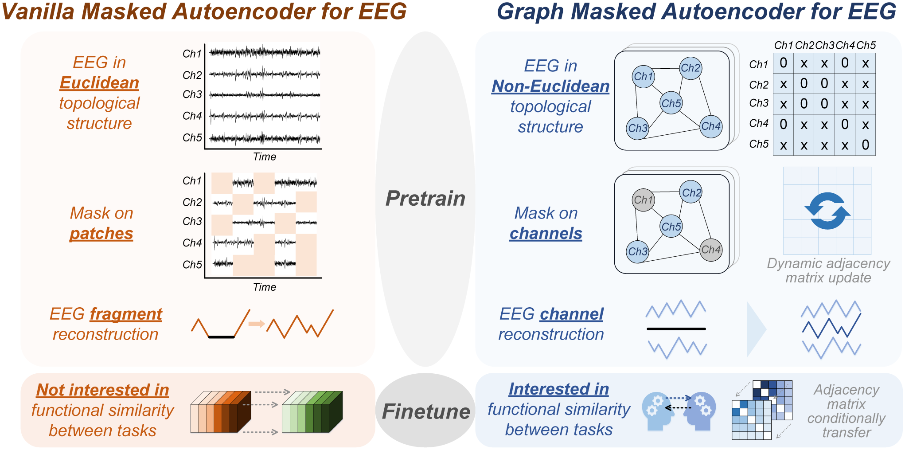
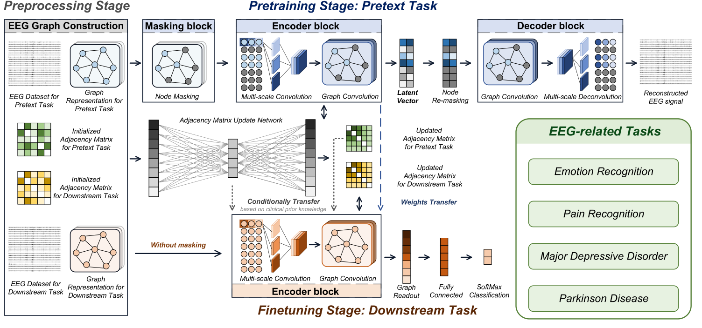

# GMAEEG: A Self-Supervised Graph Masked Autoencoder for EEG Representation Learning

**Authors:** Zanhao Fu, Huaiyu Zhu, Yisheng Zhao, Ruohong Huan, Yi Zhang, Shuohui Chen, and Yun Pan

**Published in:** IEEE Journal of Biomedical and Health Informatics, Vol. 28, No. 11, November 2024

**Code Repository:** https://github.com/fuzanhaozju/GMAEEG

---

## Main Concept



*Figure 1: Main idea of this work. An illustration of the differences between our proposed graph masked autoencoder for EEG and the vanilla masked autoencoder if being applied in EEG.*

---

## Model Architecture



*Figure 2: Overall structure of the proposed graph masked autoencoder for EEG. GMAEEG consists of three stages: preprocessing stage, pretraining stage on a pretext task, and finetuning stage on downstream tasks.*

---

## Problem Being Solved

The development of EEG autoanalysis is severely limited by:
- **Scarcity of annotated EEG data** due to high annotation costs
- **Insufficient training data** for deep learning models
- **Loss of spatial information** when applying traditional masked autoencoders (MAE) to EEG, as vanilla MAE is designed for Euclidean structures (images) and struggles with the **non-Euclidean, three-dimensional distribution of EEG electrodes**
- Need for methods that can learn from unlabeled data and transfer knowledge across different EEG-related tasks

---

## Key Innovation and Approach

GMAEEG is the **first tailored masked autoencoder specifically designed for EEG representation learning** that addresses the non-Euclidean characteristics of EEG signals. The key innovations include:

1. **Graph-Based Representation:** EEG channels are modeled as nodes in a graph, with edges representing brain functional connectivity, naturally handling the non-Euclidean structure.

2. **Adaptive Adjacency Matrix:** A learnable dynamic adjacency matrix initialized with prior knowledge (local connections, global electrode pairs, and potential long-range connectivity) that adapts to brain characteristics through an update network.

3. **Self-Supervised Pretraining-Finetuning Framework:**
   - **Pretraining:** Masked signal reconstruction on unlabeled data (emotion recognition dataset)
   - **Finetuning:** Transfer learned representations to downstream tasks
   - **Selective Transfer:** Adjacency matrix is transferred based on functional similarity between tasks

4. **Multi-Scale Temporal Feature Extraction:** Multi-scale convolution (kernel sizes 1×4, 1×8, 1×16) to capture temporal information at different scales.

5. **Spectral-Based Graph Convolution:** 5-order Chebyshev polynomial approximation for efficient spatial information extraction across EEG channels.

---

## Model Architecture Details

### Three-Stage Pipeline

#### **Stage 1: Preprocessing**
- EEG data constructed into graph structure (G = (V, A, E))
- Nodes (V): EEG channels with raw signal as features
- Adjacency matrix (A): Initialized with:
  - Weight = 1 for neighboring electrodes and 6 global pairs (F3-F4, C3-C4, P3-P4, F7-F8, T3-T4, T5-T6)
  - Weight = 0.5 for non-neighbor nodes (exploring potential long-range connectivity)
- Standard 21 channels from 10-20 electrode placement system
- 2-second sliding windows, resampled to 250 Hz

#### **Stage 2: Pretraining (Pretext Task)**

**Masking Block:**
- Randomly masks 11 channels (optimal hyperparameter)
- Masked node features replaced with learnable Gaussian noise
- "Masking with probability" strategy to reduce pretrain-finetune gap

**Encoder Block:**
- Multi-scale convolution (3 branches: kernel sizes 1×4, 1×8, 1×16) with 4 layers each
- Outputs concatenated for temporal feature extraction
- 2 spectral-based graph convolutional layers for spatial information
- Latent vector: 64 neurons (optimal hyperparameter)

**Decoder Block:**
- Re-masking of latent vector (encourages compressed representations)
- Symmetric structure to encoder:
  - Graph deconvolution for spatial information restoration
  - Multi-scale deconvolution for temporal information
- Loss: Mean Square Error (MSE) between reconstructed and original data

**Adjacency Matrix Update Network:**
- Flattens adjacency matrix (N×N → (N×N)×1)
- Two fully connected layers with reduction ratio r
- Activation: ReLU, tanh, and ELU functions
- Dynamically adjusts edge weights during both pretraining and finetuning

#### **Stage 3: Finetuning (Downstream Tasks)**

- Pretrained encoder weights transferred (no masking)
- Graph readout layer (global mean pooling)
- Fully connected layers + Softmax for classification
- Loss: Binary cross-entropy
- **Adjacency matrix transfer strategy:**
  - **Similar tasks:** Transfer pretrained adjacency matrix
  - **Dissimilar tasks:** Reinitialize adjacency matrix

---

## Main Results and Contributions

### Performance Achievements

**Superior performance across 6 binary classification tasks:**

1. **Emotion Recognition (DREAMER dataset):**
   - High Valence vs. Low Valence: **99.52%** accuracy
   - High Arousal vs. Low Arousal: **99.74%** accuracy

2. **Major Depressive Disorder (MDD dataset):**
   - MDD vs. Healthy Controls: **99.87%** accuracy

3. **Parkinson's Disease (PD dataset):**
   - On-medication vs. HC: **99.14%** accuracy
   - Off-medication vs. HC: **98.73%** accuracy

4. **Pain Recognition (private dataset):**
   - Pain vs. No Pain: **94.43%** accuracy (significantly outperforms state-of-the-art)

### Key Contributions

1. **First Graph-Based Masked Autoencoder for EEG:** Specifically tailored to handle non-Euclidean EEG characteristics, addressing spatial information loss in traditional approaches.

2. **Functional Connectivity Transfer Learning:** Demonstrated that pretrained adjacency matrices can serve as valuable prior knowledge for functionally similar tasks (emotion → pain/depression) but should be reinitialized for dissimilar tasks (emotion → Parkinson's).

3. **Label-Efficient Learning:** Even with only 1-5% labeled data, pretrained models achieve substantially better performance than training from scratch.

4. **Robustness:** Maintains competitive performance (at most 1.67% accuracy drop) under Gaussian noise perturbation (σ = 0.05), with some tasks tolerating even higher noise levels.

5. **Clinical Insights:** Graph connection analysis reveals:
   - Parietal lobe importance in pain recognition
   - Prefrontal and occipital cortex involvement in emotion (valence/arousal)
   - Prefronto-parietal network patterns in depression
   - Parieto-occipital region activity in Parkinson's disease

---

## Datasets Used

| Dataset | Task | Subjects | Length | Channels | Labels |
|---------|------|----------|--------|----------|--------|
| **DEAP** | Emotion Recognition (Pretext) | 32 | 60s × 40 clips | 32 → 21 | Valence/Arousal |
| **DREAMER** | Emotion Recognition | 23 | 60s × 18 clips | 14 → 21 | Valence/Arousal |
| **MDD** | Depression Detection | 64 | 180s | 19 → 21 | MDD/HC |
| **PD** | Parkinson's Detection | 31 | 180s | 32 → 21 | PDon/PDoff/HC |
| **Pain** | Pain Recognition | 33 | 100s (mean) | 21 | Pain/No Pain |

**Preprocessing:** All datasets filtered, resampled to 250 Hz, cleaned with ICA, segmented (2s windows, no overlap), normalized (min-max), and aligned to standard 21 channels.

---

## Clinical Significance

The graph-based approach enables exploration of brain functional connectivity patterns across different tasks:

- **Task-Specific Connectivity:** Different EEG tasks exhibit distinct functional connectivity patterns that can be learned and visualized
- **Transfer Learning Potential:** Functionally similar tasks (emotion, pain, depression) share connectivity patterns supported by convergent clinical evidence
- **Future Clinical Applications:** The learned adjacency matrices may provide insights for clinical neuroscience research and potentially assist in understanding brain network dysfunction in various neurological conditions

---

## Implementation Details

- **Framework:** Python 3.7, PyTorch 1.10.0, torch-geometric 2.1.0
- **Hardware:** GeForce RTX 2080Ti GPU
- **Optimizer:** Adam
- **Learning Rates:**
  - Pretext task: 0.0005
  - Emotion recognition: 0.0003
  - MDD/PD/Pain: 0.00005
- **Batch Size:** 32

---

## Citation

```bibtex
@article{fu2024gmaeeg,
  title={GMAEEG: A Self-Supervised Graph Masked Autoencoder for EEG Representation Learning},
  author={Fu, Zanhao and Zhu, Huaiyu and Zhao, Yisheng and Huan, Ruohong and Zhang, Yi and Chen, Shuohui and Pan, Yun},
  journal={IEEE Journal of Biomedical and Health Informatics},
  volume={28},
  number={11},
  pages={6486--6497},
  year={2024},
  publisher={IEEE},
  doi={10.1109/JBHI.2024.3443651}
}
```

---

**Keywords:** EEG, graph network, masked autoencoder, representation learning, self-supervised learning, brain-computer interface, emotion recognition, depression detection, Parkinson's disease, pain recognition
