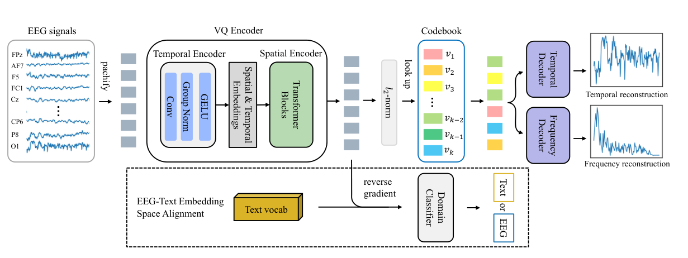
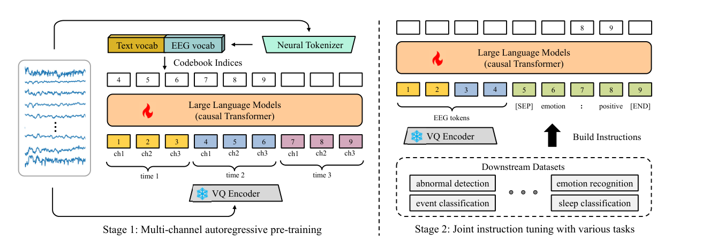

# NeuroLM: A Universal Multi-Task Foundation Model for Bridging the Gap between Language and EEG Signals

**Authors:** Wei-Bang Jiang, Yansen Wang, Bao-Liang Lu, Dongsheng Li
**Affiliation:** Shanghai Jiao Tong University, Microsoft Research Asia
**Published:** ICLR 2025
**GitHub:** https://github.com/935963004/NeuroLM

---

## Model Architecture

### Neural Tokenizer



*Figure 2: Text-aligned neural tokenizer architecture showing VQ encoder, codebook, temporal-frequency decoder, and EEG-text embedding space alignment through adversarial training.*

### Training Pipeline



*Figure 3: Complete NeuroLM training pipeline showing Stage 1 (Multi-channel autoregressive pre-training) and Stage 2 (Multi-task instruction tuning).*

---

## Problem Being Solved

Current EEG pre-training models face critical limitations:
- **Lack of Versatility:** Existing models require full fine-tuning for each downstream task, limiting their usability
- **Resource Inefficiency:** Task-specific fine-tuning demands substantial computational and storage resources
- **Single-Task Paradigm:** Models are confined to perform only one task after fine-tuning, despite large-scale pre-training

The paper addresses these challenges by proposing the first multi-task foundation model for EEG that can handle diverse tasks within a single unified model through instruction tuning.

---

## Key Innovation/Approach

NeuroLM introduces three major innovations:

### 1. Text-Aligned Neural Tokenizer
- Uses **vector-quantized (VQ) temporal-frequency prediction** to encode continuous EEG signals into discrete neural tokens
- Employs **adversarial training** with a domain classifier to align EEG embeddings with text embedding space
- Reconstructs both temporal and frequency domains of EEG signals for comprehensive representation
- Codebook size: 8,192 × 128 dimensions

### 2. Multi-Channel Autoregressive Pre-Training
- Treats EEG signals as a "foreign language" for Large Language Models (LLMs)
- Implements **stair-stepping attention masks** where each EEG token observes tokens from all channels at current and previous time steps
- Enables the model to learn causal EEG representations across different channels
- Pre-trained on approximately **25,000 hours** of EEG data
- Formulated as: p(I₁₁, I₁₂, ..., I_CT) = ∏ᵗ p(I₁ₙ, I₂ₙ, ..., I_Cn | h₁₁, h₁₂, ..., h_C(t-1))

### 3. Multi-Task Instruction Tuning
- First to introduce instruction tuning for EEG signal processing
- Uses special token [SEP] to concatenate EEG and text instructions
- Supports both binary (Yes/No) and multiple-choice question formats
- Loss calculated only on answer part for stable predictions
- Enables unified multi-task learning and inference within a single model

---

## Model Architecture Details

### Three Model Variants:
1. **NeuroLM-B (Base):** 254M parameters, 12 transformer layers, 768 hidden size
2. **NeuroLM-L (Large):** 500M parameters, 24 transformer layers, 1024 hidden size
3. **NeuroLM-XL (Extra Large):** 1.7B parameters (record-breaking for EEG), 48 transformer layers, 1600 hidden size

### Neural Tokenizer Components:
- **VQ Encoder:**
  - Temporal encoder: 1D convolutions with spatial and temporal embeddings
  - Spatial encoder: Transformer blocks for patch interaction
- **Codebook:** 8,192 discrete embeddings of 128 dimensions
- **Decoders:** Separate temporal and frequency decoders
- **Domain Classifier:** For EEG-text alignment via gradient reversal layer

### Base LLM:
- Built on **GPT-2** architecture for compatibility and efficiency
- Maximum sequence length: 1024 patches (tokens)
- Patch size: 200 samples (1 second at 200 Hz)
- Vocabulary extended with EEG codebook indices

### Training Pipeline (3 Stages):
1. **Stage 1 - Neural Tokenizer Training:**
   - 50 epochs with cosine learning rate schedule
   - Peak learning rate: 5e-5
   - Loss: Temporal + Frequency reconstruction + Codebook + Commitment + Alignment

2. **Stage 2 - Autoregressive Pre-Training:**
   - 20 epochs on 25,000 hours of EEG data
   - Peak learning rate: 6e-4
   - Gradient clipping: 1.0

3. **Stage 3 - Instruction Tuning:**
   - 5 epochs (3 for XL variant)
   - Peak learning rate: 5e-4 (B), 5e-5 (L), 2e-5 (XL)

---

## Main Results/Contributions

### Performance Across Six Tasks:
The model demonstrates competitive performance on diverse EEG tasks:

1. **TUAB (Abnormal Detection):**
   - Balanced Acc: 0.7826, AUROC: 0.7816

2. **TUEV (Event Classification - 6 classes):**
   - Balanced Acc: 0.4560, Weighted F1: 0.7153

3. **SEED (Emotion Recognition - 3 classes):**
   - Balanced Acc: 0.5554, Weighted F1: 0.5599

4. **HMC (Sleep Stage - 5 classes):**
   - Balanced Acc: 0.6737, Weighted F1: 0.7126

5. **Workload (Cognitive Load):**
   - Balanced Acc: 0.6172, AUROC: 0.6253

6. **TUSL (Slowing Event - 3 classes):**
   - Balanced Acc: 0.6734, Weighted F1: 0.6743

### Key Findings:
- **First multi-task EEG model:** Achieves performance comparable to most single-task baselines
- **Scalability:** Larger variants (L, XL) show improved performance on most datasets
- **Robustness:** Maintains stable performance with varying instruction data sizes
- **Efficiency:** Single model handles six different tasks without task-specific fine-tuning

### Ablation Studies:
- Multi-channel autoregressive pre-training significantly improves performance
- Both temporal and frequency domain reconstruction are important (task-dependent)
- EEG-text alignment is crucial for proper instruction following
- Robust to option shuffling in multiple-choice questions (except on very small datasets)

---

## Datasets Used

### Pre-training Datasets (~25,000 hours total):
- **TUEG:** 26,846 clinical EEG recordings (~24,000 hours)
- **SEED Series:** Multiple emotion recognition datasets (170.54 hours)
- **BCI Competition IV-1:** Motor imagery (8.21 hours)
- **Emobrain:** Multimodal emotion (4.94 hours)
- **Grasp and Lift:** Motor tasks (11.72 hours)
- **Inria BCI:** P300 spelling (29.98 hours)
- **Motor Movement/Imagery:** 109 volunteers (47.3 hours)
- **Raw EEG Data:** Categorization tasks (34.35 hours)
- **Resting State:** 22 subjects (3.04 hours)
- **Siena Scalp EEG:** 14 patients (30.47 hours)
- **SPIS Resting State:** Sustained attention (0.83 hours)
- **Target vs Non-Target:** Brain Invaders P300 BCI (16 hours)
- **Self-collected corpus:** 140+ subjects (342.23 hours)

### Downstream Evaluation Datasets:
1. **TUAB:** 409,455 samples, binary abnormality classification
2. **TUEV:** 112,491 samples, 6-class event type classification
3. **SEED:** 38,475 samples, 3-class emotion recognition
4. **HMC:** 137,243 samples, 5-class sleep stage classification
5. **Workload:** 2,088 samples, binary cognitive workload
6. **TUSL:** 245 samples, 3-class slowing event classification

---

## Technical Contributions

1. **Unified Multi-Task Paradigm:** First demonstration that EEG tasks can be unified through instruction tuning with LLMs

2. **Text-Aligned Neural Tokenizer:** Novel approach to align EEG signals with text embedding space through adversarial training

3. **Multi-Channel Autoregression:** Custom pre-training strategy adapted for multi-channel EEG signals with stair-stepping attention masks

4. **Record-Breaking Scale:** Largest EEG model (1.7B parameters) pre-trained on the largest public EEG corpus (~25,000 hours)

5. **Theoretical Foundation:** VAE-based interpretation connecting neural tokenizer training with autoregressive pre-training

---

## Limitations and Future Directions

### Current Limitations:
- Performance still lags behind state-of-the-art single-task methods
- Sensitive to hyperparameter settings
- Space-wise alignment (coarse-grained) rather than embedding-wise alignment due to lack of EEG-text pairs

### Future Outlook:
- Utilize more advanced LLMs (e.g., LLaMA 3) as base models
- Adopt mixture-of-experts approach for better multimodal learning
- Develop finer-grained EEG-text alignment methods with contrastive learning

---

## Citation

```bibtex
@inproceedings{jiang2025neurolm,
  title={NeuroLM: A Universal Multi-Task Foundation Model for Bridging the Gap between Language and EEG Signals},
  author={Jiang, Wei-Bang and Wang, Yansen and Lu, Bao-Liang and Li, Dongsheng},
  booktitle={International Conference on Learning Representations (ICLR)},
  year={2025}
}
```

---

**Note:** This represents a significant milestone in EEG signal processing, demonstrating that treating brain signals as a "foreign language" for LLMs enables unprecedented multi-task capabilities in brain-computer interfaces and healthcare applications.
