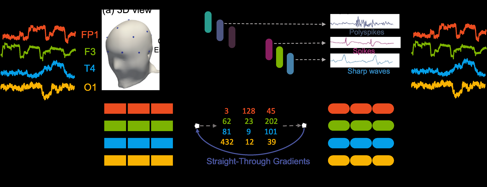

# EEGFormer: Towards Transferable and Interpretable Large-Scale EEG Foundation Model



## Overview

EEGFormer is a novel foundation model for electroencephalography (EEG) analysis that leverages self-supervised learning on large-scale EEG data. The model introduces a vector-quantized pretraining approach specifically designed to learn universal, transferable, and interpretable representations from multi-channel EEG signals.

## Problem Being Solved

Existing self-supervised learning approaches for EEG data suffer from several limitations:
- They focus on pretraining on individual datasets corresponding to single downstream tasks, failing to leverage the power of abundant available data
- They derive sub-optimal solutions with limited generalization across different EEG analysis tasks
- They rely on end-to-end model learning that lacks interpretability, which is critical for healthcare applications
- They cannot provide meaningful insights into learned patterns that medical professionals can understand and trust

## Key Innovation and Approach

EEGFormer introduces several key innovations:

1. **Large-Scale Pretraining**: First foundation model pretrained on the massive 1.7TB TUH EEG Corpus, enabling learning from diverse EEG data across multiple tasks and patient populations

2. **Vector-Quantized Learning**: Uses discrete representation learning with a vector quantizer and learned codebook, departing from conventional masked reconstruction strategies. This approach:
   - Encodes EEG signals into discrete tokens
   - Enables interpretability through analysis of learned discrete codes
   - Provides meaningful patterns that can be understood by medical professionals

3. **Transferable Representations**: Learns universal EEG representations that transfer effectively across:
   - Multiple downstream tasks (abnormality detection, seizure detection, artifact detection, etc.)
   - Different datasets (including out-of-distribution neonatal seizure data)
   - Various clinical scenarios

## Model Architecture Details

### Preprocessing
- EEG signals resampled to uniform 250 Hz sampling rate
- Fixed-length 12-second EEG segments
- Fast Fourier Transform (FFT) applied to convert time-domain signals to frequency-domain amplitude features

### Architecture Components

1. **Slice & Encode Module**:
   - Input: Multi-variate EEG signal X ∈ R^(L×C) where L is sequence length and C is number of channels
   - Instance normalization applied to frequency-domain inputs
   - Each channel split into patches of length P with stride S
   - Learnable patch embedding (dimension D=128) and position embeddings
   - Transformer encoder (6-12 layers depending on model size) processes patches in channel-independent manner

2. **Vector Quantizer**:
   - Codebook with K embeddings (K=512 to 2048 depending on model variant)
   - Nearest neighbor lookup: zi = argmin_j ||hi - vj||²
   - Generates discrete indices for each patch representation
   - Enables interpretable discrete representation of EEG patterns

3. **Decode & Reconstruct Module**:
   - Shallow 3-layer Transformer decoder
   - Takes quantized codebook embeddings as input
   - Reconstructs original frequency-domain EEG signals

### Training Objective
Minimizes combined loss:
- Reconstruction loss: ||Xrec - X||²
- Codebook commitment loss with stop-gradient operators
- Enables learning of meaningful discrete codes while maintaining reconstruction quality

### Model Variants
- **EEGFormer-s**: 6-layer encoder, K=512 codebook size
- **EEGFormer-b**: 8-layer encoder, K=1024 codebook size
- **EEGFormer-l**: 12-layer encoder, K=2048 codebook size

### Fine-tuning
- Both encoder and decoder weights are fine-tuned for downstream tasks
- Codebook is also fine-tuned to incorporate domain-specific knowledge
- Supports classification and detection tasks

## Main Results and Contributions

### Performance Achievements

1. **TUH Corpus Tasks** (in-dataset evaluation):
   - **TUAB** (Abnormality Detection): 0.876 AUROC, 0.872 AUPRC
   - **TUAR** (Artifact Detection): 0.852 M-AUROC, 0.483 M-AUPRC
   - **TUSL** (Slowing Detection): 0.679 M-AUROC, 0.389 M-AUPRC
   - **TUSZ** (Seizure Detection): 0.883 AUROC, 0.556 AUPRC

2. **Transfer Learning** (out-of-distribution):
   - **Neonate Dataset**: 0.842 AUROC, 0.578 AUPRC (15.8% improvement over best baseline)
   - Demonstrates strong transferability to completely different patient population (neonatal EEG)

3. **Comparison with Baselines**:
   - Outperforms specialized models (EEGNet, TCN, EEG-GNN, GraphS4mer)
   - Surpasses prior self-supervised method (BrainBERT)
   - Linear probing performance comparable to supervised baselines

### Interpretability Contributions

1. **Seizure Localization**:
   - Discrete tokens enable n-gram feature extraction
   - Naive Bayes classifier on n-grams achieves 0.741 AUROC without fine-tuning
   - Can identify and localize seizure patterns (e.g., spike-wave complexes)
   - Highlights epileptiform discharges across brain regions (frontal, parietal, temporal lobes)

2. **Medical Pattern Recognition**:
   - Learned codebook captures clinically significant patterns
   - Can identify polyspikes, spikes, and sharp waves
   - Recognizes spike-wave complexes indicating epileptiform discharge
   - Provides interpretable visualizations for medical professionals

3. **Pretraining Benefits**:
   - Longer pretraining epochs consistently improve downstream performance
   - Model learns increasingly refined representations with more training

## Datasets Used

### Pretraining Dataset
- **TUH Corpus**: 1.7TB of unlabeled EEG data from Temple University Hospital
- Large-scale, diverse collection of clinical EEG recordings
- Enables learning of universal EEG representations

### Evaluation Datasets

1. **TUAB Corpus**: Normal vs. abnormal EEG detection
2. **TUAR Corpus**: Multi-class artifact detection (5 artifact types)
3. **TUSL Corpus**: Slowing event detection
4. **TUSZ Corpus**: Seizure event detection
5. **Neonate Dataset** (Stevenson et al. 2019): Neonatal seizure detection
   - Out-of-distribution dataset (not part of TUH)
   - Tests transferability to different age group and clinical scenario

## Key Contributions Summary

1. Novel discrete representation learning approach for EEG foundation models
2. First large-scale EEG foundation model pretrained on 1.7TB dataset
3. Comprehensive evaluation across 5 downstream tasks with superior performance
4. Demonstrated transferability to out-of-distribution neonatal data
5. Interpretable representations through learned codebook and discrete tokens
6. Clinically meaningful pattern recognition (seizure localization, epileptiform discharge detection)

## Authors

Yuqi Chen¹, Kan Ren², Kaitao Song¹, Yansen Wang¹, Yifan Wang², Dongsheng Li¹, Lili Qiu¹

¹ Microsoft Research
² ShanghaiTech University

## Citation

```
@article{chen2024eegformer,
  title={EEGFormer: Towards Transferable and Interpretable Large-Scale EEG Foundation Model},
  author={Chen, Yuqi and Ren, Kan and Song, Kaitao and Wang, Yansen and Wang, Yifan and Li, Dongsheng and Qiu, Lili},
  journal={arXiv preprint arXiv:2401.10278},
  year={2024}
}
```

## Links

- arXiv: https://arxiv.org/abs/2401.10278
- TUH EEG Corpus: https://isip.piconepress.com/projects/tuh_eeg/