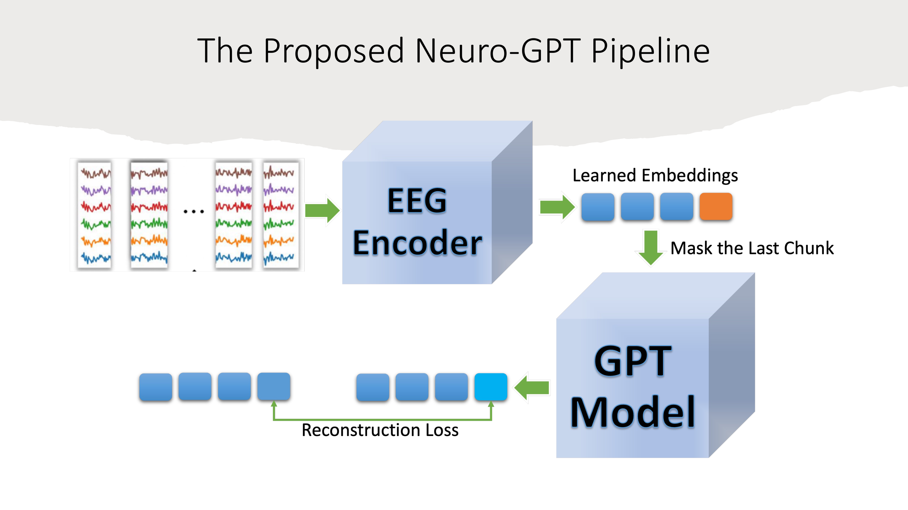

# Neuro-GPT: A Foundation Model for Advanced EEG Decoding

**Authors:** Wenhui Cui¹, Woojae Jeong¹, Philipp Thölke², Takfarinas Medani¹, Karim Jerbi², Richard M. Leahy¹

¹University of Southern California
²University of Montreal

---

## Main Architecture

*Figure: The Proposed Neuro-GPT Pipeline showing the end-to-end architecture from EEG chunks to learned embeddings and reconstruction.*

---

## Problem Being Solved

Neuro-GPT addresses critical challenges in neural data analysis:

- **Data Scarcity**: Limited availability of labeled EEG data for specific tasks (e.g., Post-Traumatic Epilepsy prediction where only small numbers of subjects are available)
- **Data Heterogeneity**: EEG recordings from patients with conditions like traumatic brain injury are highly heterogeneous with varying:
  - Channel configurations
  - Sampling frequencies
  - Recording durations
  - Presence of epilepsy, seizures, and artifacts
- **Generalization Difficulty**: Traditional machine learning models struggle to extract representative features and generalize across heterogeneous EEG datasets

The model aims to create a foundation model that learns transferable, generalizable features from large-scale EEG data that can be fine-tuned for downstream tasks with limited data.

---

## Key Innovation/Approach

### Inspiration from Large Language Models

Neuro-GPT applies the success of large language models (like ChatGPT/GPT) to EEG signal processing by:

1. **Treating EEG as Sequential Data**: EEG time series are split into chunks, where each chunk is treated analogously to a "word" or "token" in natural language processing

2. **Self-Supervised Pretraining**: The model is pretrained on large-scale unlabeled EEG data using a causal reconstruction task, learning inherent temporal patterns without requiring labeled data

3. **Transfer Learning Strategy**: Knowledge from large-scale pretraining transfers to downstream tasks where data is scarce, similar to how language models transfer to specific NLP tasks

4. **Two-Component Architecture**:
   - **EEG Encoder**: Extracts spatial-temporal features from raw EEG chunks
   - **GPT Model**: Learns temporal relationships between encoded chunks using transformer architecture

---

## Model Architecture Details

### Overall Pipeline

The Neuro-GPT architecture consists of two main components working in sequence:

1. **EEG Encoder**
   - Processes raw EEG chunks (channel × time)
   - Architecture: Temporal Conv → Spatial Conv → Average Pooling
   - Extracts spatial-temporal features using:
     - **Temporal convolution** to capture time-domain patterns
     - **Spatial convolution** to capture cross-channel relationships
     - **Self-attention mechanism** (N× Self-Attention blocks with Dot Product, Scaling, Softmax)
     - **Feed-forward neural networks** for feature transformation
   - Produces flattened feature vectors (tokens) for each EEG chunk
   - Rationale: GPT models alone only capture temporal patterns, but EEG has rich spatial-temporal information that needs specialized encoding

2. **GPT Model (Decoder-Only Transformer)**
   - Standard decoder-only language model architecture
   - Components:
     - Token/Position Embedding layer
     - Multiple Decoder Blocks containing:
       - Masked Self-Attention (prevents seeing future chunks)
       - Feed Forward Neural Network
     - Output layer for reconstruction

### Training Objective: Causal Reconstruction Loss

- **Self-supervised task**: Predict each masked chunk given only its preceding chunks (without seeing future)
- **Masking strategy**: Mask one chunk at a time in sequence
- **Loss function**: L = -∑ᵢ₌₁ᴺ log P(tᵢ|t₁,t₂,...,tᵢ₋₁)
  - Where t represents each chunk, N is total number of chunks
- **Causal constraint**: Model learns causal temporal relations between every chunk, enforcing autoregressive prediction

### Input Configuration

- EEG recordings split into T-second chunks (2 seconds) with overlapping (0.2s overlap)
- Randomly sample 8 contiguous chunks per subject during training
- Each chunk dimension: 22 channels × 500 timepoints (at 250 Hz)
- Training batch organized as: (chunk1, chunk2, ..., chunk8, chunk1, chunk2, ..., chunk8, ...)
- Input to GPT: num_chunks × F (where F is flattened feature dimension from encoder)

### Channel Alignment Strategy

To handle different channel configurations between pretraining and downstream datasets:

1. **Source Localization Approach**:
   - Estimate linear inverse operators (inverse kernels) W_pret and W_dst for both datasets
   - Solve forward and inverse models for source localization

2. **Re-sampling Procedure**:
   - Map downstream data to pretraining channel configuration: Ê_dst = W_pret⁺ × S_dst
   - Where S_dst = W_dst × E_dst (source estimates from downstream data)
   - Enables consistent channel representation across heterogeneous datasets

---

## Main Results/Contributions

### Pretraining Dataset

- **TUH EEG Corpus**: 26,846 clinical EEG recordings from Temple University Hospital
- **Training set**: 19,000 recordings
- **Validation set**: 1,000 recordings
- **Characteristics**:
  - International 10-20 system with 22 common channels
  - Heterogeneous configurations (resampled to 250 Hz)
  - Includes epilepsy, seizure, and artifact data

### Downstream Evaluation: BCI Competition IVa Dataset

- **Task**: 4-class motor imagery classification (left hand, right hand, feet, tongue)
- **Data**: 9 subjects, 22 EEG channels, 250 Hz sampling
- **Protocol**: 288 trials per subject (2 sessions), leave-one-out cross-validation
- **Evaluation**: 9-fold cross-validation with different fine-tuning strategies

### Performance Results

**Mean accuracy over 9-fold cross-validation:**

| Model Configuration | Without Pretraining | With Pretraining |
|---------------------|---------------------|------------------|
| **Encoder + GPT** (full model) | 0.597 ± 0.093 | **0.628 ± 0.096** |
| **Encoder-only** (freeze GPT) | 0.606 ± 0.098 | **0.631 ± 0.089** |
| **GPT-only** (freeze Encoder) | 0.497 ± 0.061 | 0.507 ± 0.063 |
| **Baseline (BENDR)** | 0.426 | - |

**Key Findings:**

1. **Pretraining improves performance**: All configurations with pretraining outperform training from scratch
2. **Best performance**: Encoder-only fine-tuning achieves 63.1% accuracy (vs. 60.6% without pretraining)
3. **Encoder is crucial**: The spatial-temporal encoder captures most discriminative features
4. **Substantial improvement over baseline**: Neuro-GPT significantly outperforms BENDR (42.6%)
5. **Training convergence**: Both training and evaluation losses converge smoothly, indicating stable learning

### Key Contributions

1. **First GPT-style foundation model for EEG**: Adapts transformer-based language model architecture to EEG signal processing
2. **Effective transfer learning**: Demonstrates that large-scale pretraining on heterogeneous clinical EEG data improves downstream task performance
3. **Generalizable features**: Shows the foundation model encodes inherent and fundamental EEG features that transfer across different datasets and tasks
4. **Practical solution**: Addresses data scarcity and heterogeneity challenges common in neuroscience research
5. **Novel architecture design**: Combines spatial-temporal EEG encoder with causal transformer for optimal EEG representation learning

---

## Datasets Used

### Pretraining Dataset

**TUH EEG Corpus**
- **Source**: Temple University Hospital
- **Size**: 26,846 clinical EEG recordings
- **Split**: 19,000 training / 1,000 validation / remaining test
- **Characteristics**:
  - Heterogeneous channel configurations and sampling frequencies
  - Various recording durations
  - Contains data with epilepsy, seizures, and artifacts
  - International 10-20 system electrode placement
  - Selected 22 common channels for standardization

**Preprocessing Pipeline** (using Brainstorm):
- Resample to 250 Hz (majority sampling frequency)
- Select 22 common channels from International 10-20 system
- Bad channel removal
- Notch filter at 60 Hz (remove power line noise)
- Band-pass filter: 0.5 - 100 Hz
- Remove DC offset and linear trend
- Temporal normalization

### Downstream Evaluation Dataset

**BCI Competition IV Dataset 2a**
- **Source**: https://www.bbci.de/competition/iv/#dataset2a
- **Task**: 4-class motor imagery (cued motor imagery)
- **Classes**: Left hand, right hand, feet, tongue
- **Subjects**: 9 participants
- **Channels**: 22 EEG channels (0.5-100 Hz, notch filtered) + 3 EOG channels
- **Sampling rate**: 250 Hz
- **Structure**:
  - 2 sessions per subject
  - 6 runs per session with short breaks
  - 48 trials per run (12 per class)
  - Total: 288 trials per session, 576 trials per subject
- **Trial timing**:
  - 0-1s: Fixation cross
  - 1-2s: Beep
  - 2-3s: Cue presentation
  - 3-6s: Motor imagery period
  - 6-7s: Break

---

## Future Directions

The authors propose several extensions:

1. **Alternative LLM architectures**: Apply other large language models (LLaMA, Alpaca, PaLM) to EEG
2. **Channel-agnostic encoder**: Evolve the EEG encoder to adapt to varying numbers of channels and different electrode montages automatically
3. **Multi-modal integration**: Incorporate other neuroimaging modalities (fMRI) to build a multi-modal Neuro-GPT
4. **Expanded applications**: Test on additional downstream tasks beyond motor imagery (e.g., seizure detection, cognitive state classification, brain-computer interfaces)
5. **Larger scale pretraining**: Expand to even larger EEG datasets for improved generalization

---

## Conclusion

Neuro-GPT successfully demonstrates that:

- **Foundation models work for EEG**: Pretraining on large-scale EEG data boosts downstream task performance where data is heterogeneous and scarce
- **Transferable representations**: The foundation model encodes inherent and fundamental features of EEG that generalize across different datasets and experimental paradigms
- **Practical impact**: Provides a viable solution to the pervasive data scarcity problem in neuroscience research
- **Bridge to NLP**: Successfully bridges advances in natural language processing to neuroscience, opening new directions for neural signal analysis

The work represents a significant step toward universal EEG models that can be adapted to diverse clinical and research applications with minimal task-specific data.